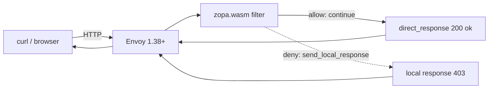
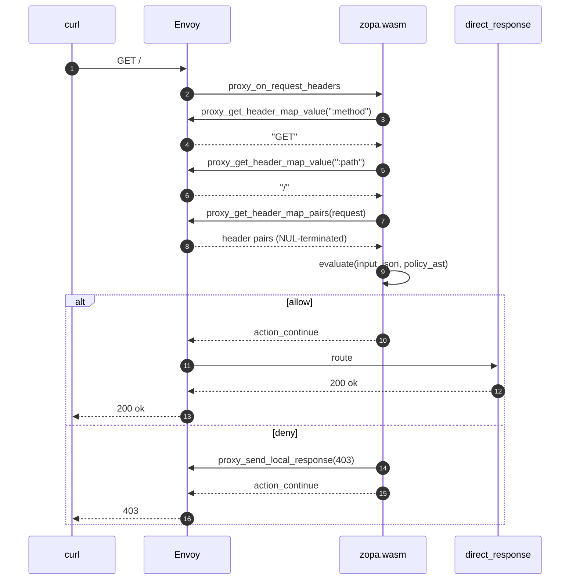

# Envoy + zopa.wasm

End-to-end example: Envoy with `zopa.wasm` as a proxy-wasm HTTP
filter. The route in `envoy.yaml` ends in `direct_response`, so no
upstream is needed. zopa decides per request: allow falls through
to the response, deny short-circuits with a 403.

## Topology



## Request flow



## Run it

Requires Envoy with the `wamr` (or `v8`) runtime.

```bash
brew install envoy            # ships wamr
zig build --release=small     # produces zig-out/bin/zopa.wasm
zig build test-envoy          # boots envoy, runs curl assertions
```

Manual run:

```bash
envoy -c examples/envoy/envoy.yaml --log-level info
# in another shell:
curl -i http://127.0.0.1:10070/             # GET  -> 200
curl -i -X POST http://127.0.0.1:10070/     # POST -> 403
```

The bundled bootstrap uses placeholder ports (`__PORT__`,
`__ADMIN_PORT__`) and a placeholder wasm path (`__WASM_PATH__`)
that `run.sh` substitutes. For a manual run, replace them yourself
or copy the file and edit the values.

## The bootstrap

`envoy.yaml` declares one HTTP filter chain:

1. `envoy.filters.http.wasm` -- loads zopa with the policy AST as
   plugin configuration.
2. `envoy.filters.http.router` -- terminates the route at a
   `direct_response`.

The shipped policy is the simplest meaningful one:

```json
{
  "type": "module",
  "rules": [
    { "type": "rule", "name": "allow", "default": true,
      "value": { "type": "value", "value": false } },
    { "type": "rule", "name": "allow", "body": [
      { "type": "eq",
        "left":  { "type": "ref", "path": ["input", "method"] },
        "right": { "type": "value", "value": "GET" } }
    ]}
  ]
}
```

Deny by default, allow when `input.method == "GET"`. Replace the
inline JSON to model whatever you need; the AST schema is documented
in [`docs/ast.md`](../../docs/ast.md).

## Picking a runtime

```yaml
vm_config:
  runtime: envoy.wasm.runtime.wamr   # or .v8 / .wasmtime / .null
```

Which runtimes are available depends on how Envoy was built.

| Build                                   | Ships          |
| --------------------------------------- | -------------- |
| Homebrew                                | `null`, `wamr` |
| Official Docker (`envoyproxy/envoy:*`)  | `null`, `v8`   |
| Self-built with `--define wasm=...`     | All requested  |

zopa is plain `wasm32-freestanding` with only the proxy-wasm
imports, so any runtime works -- pick whatever your Envoy has.

## Customizing for your own deployment

- **Route to a real upstream.** Replace `direct_response` with a
  `cluster: ...` reference in `envoy.yaml` and define the cluster
  under `static_resources.clusters`.
- **Different policy targets.** zopa probes the rule named `"allow"`
  by default; `default_target_rule` in `src/eval.zig` is the knob if
  you want to change it.
- **Header-driven decisions.** Real headers are available under
  `input.headers["name"]`. Pseudo-headers are promoted to top-level
  `input.method` / `input.path`.

## Troubleshooting

- `Failed to create Wasm VM using envoy.wasm.runtime.v8 ... Envoy was
  compiled without support for it` -- pick a runtime your build has
  (Homebrew has `wamr`).
- All requests return 403 -- check that `proxy_get_header_map_value`
  for `:method` works in your runtime. Run with
  `--component-log-level wasm:debug` and add a `proxy_log` call in
  `src/proxy_wasm.zig` to confirm what the host returns.
- Envoy refuses to start with "Unable to parse JSON as proto" --
  the bootstrap file's extension matters. Use `.yaml`.

See [`../../docs/proxy-wasm.md`](../../docs/proxy-wasm.md) for the
full ABI surface and the host-side quirks zopa works around.
